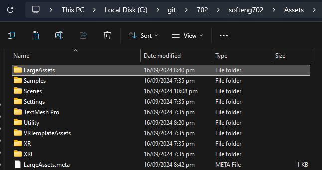
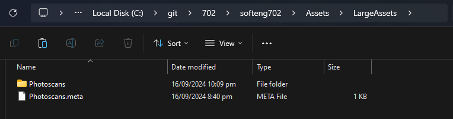

# softeng702

This is a VR project built in Unity designed for an experimental study on the effects of 3D VR vs 2D Video in promoting empathy on a conflict scenario. The project was made in UoA SOFTENG 702 by Group 2 under the supervision of our tutor.

## Usage Instructions

### Unity Setup

1. Install [Unity](https://unity.com/releases/editor/archive) (v2022.3.46f1) and [Unity Hub](https://unity.com/download) on your local machine.

2. Create a Unity account with an institutional or personal login.

3. In Unity Hub, sign in with your personal login, and "Locate" the installed Unity Editor (Specifically, the `Unity.exe` file) in your storage. E.g. `C:\Program Files\Unity 2022.3.46f1\Editor\Unity.exe`.

4. In Unity Hub, obtain a personal or education Unity license depending on your situation.

### Project Setup

1. In your terminal, clone this repository onto your local machine.

```bash
git clone https://github.com/jeremyting02/softeng702.git
```

2. In Unity Hub, "Add" (Add project from disk) the cloned project from your storage.

### Assets importing

1. To import assets, create a `LargeAssets` directory inside the `Assets` directory in the root directory. E.g. `Assets/LargeAssets`.



2. Download all assets from [this Google Drive folder](https://drive.google.com/drive/folders/17IfZPfabtWm6l2QBP7bU9RIu1nxLhhtB?usp=drive_link). Alternatively, download all the assets from the website links listed in this [file](https://github.com/jeremyting02/softeng702/blob/main/downloads.md).

3. Place all downloaded asset folders inside the `Assets/LargeAssets` directory.



4. Inside Unity Editor, import all downloaded assets.

### Program Run

1. To run the VR environment, click the play button located on the top middle position of the window.
