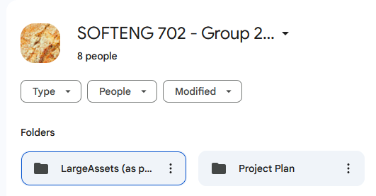
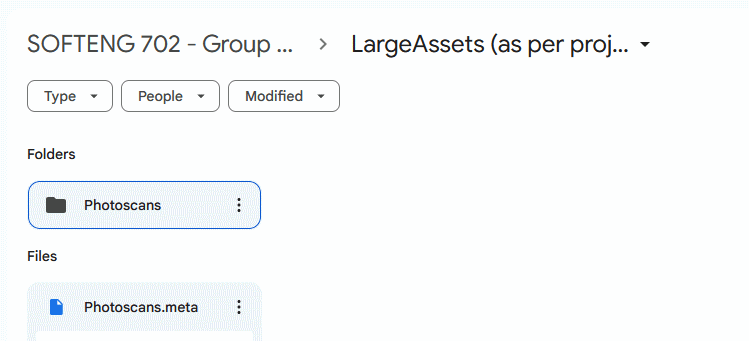
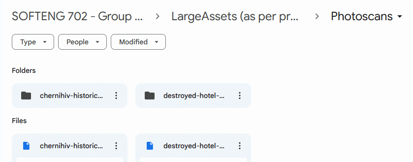
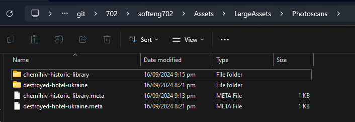

# softeng702

## Asset importing

To import assets, take the `LargeAssets` folder on Google Drive and add it to the Assets folder in the Unity project as per the images below:

### Assets Folder Example

### LargeAssets Folder Example

### Photoscans Folder Example

